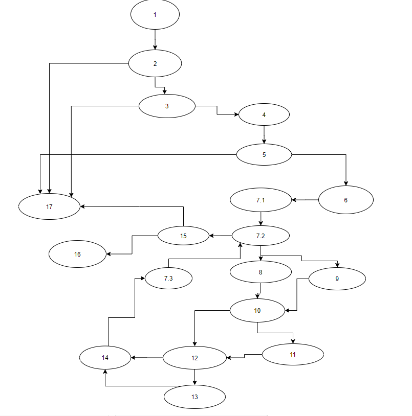

# SI_lab2_182003
## Ѓоко Јанкоски, 182003

### Група на код :
Ја добив групата 4
### Цикломатска комплексност
Цикломатската комплексност на овој код е 10, истата ја добив преку одземање на бројот на ребра со бројот на јазли и додавање 2.
### Control Flow Graph :

### Тест случаи според критериумот Everybranch
1-2

2-3

2-17

3-4

3-17

4-5

5-6

5-17

6-7.1

7.1-7.2

7.2-8

7.2-15

8-9

8-10

9-10

10-11

10-12

11-12

12-13

12-14

13-14

14-7.3

7.3-7.2

15-16

15-17

Се генерираат случаи кога и test-cases ќе ги посетат 2та можни избори

### Тест случаи според критериумот MC

T // T

F // X

T // F

T // T

F // X

T // F

T // T // T

F // X // X

T // F // X

T // T // X

Се евалуираат сите можни комбинации во If условите во кодот
